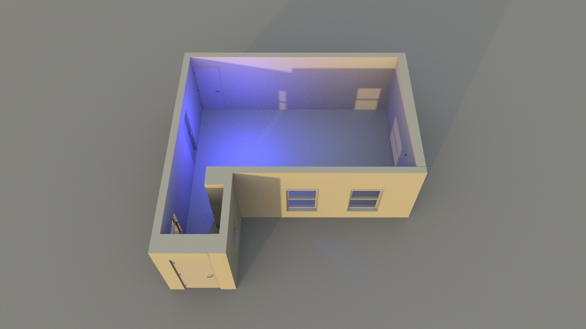

# ESPectre WiFi Sensing System

> Built on top of the original [ESPectre](https://github.com/EdoardoLuciani/espetre) project by Edoardo Luciani.

A passive, infrastructure-free room-level occupancy and motion localisation system using WiFi Channel State Information (CSI) collected from a single ESP32 node. No cameras, no PIR sensors, no wearables — just the existing WiFi signal. No modifications of router needed either, this works on any commerical router.

---

## How It Works

The system exploits the fact that human movement disturbs the multipath propagation of WiFi signals in a measurable and spatially-dependent way. By analysing the per-subcarrier amplitude patterns of CSI frames collected at the ESP32 receiver, a trained Random Forest classifier can distinguish between:

- **Baseline** — no movement / empty room
- **Quadrant 1** — movement in the hallway area
- **Quadrant 2** — movement in the stairway area

Classification runs continuously in Home Assistant at ~30 predictions per second, with results exposed as a sensor entity that can trigger automations.

---

## System Architecture
```
┌─────────────────────┐         MQTT          ┌──────────────────────────────┐
│     ESP32-S3/C6     │  ──────────────────►  │      Home Assistant          │
│                     │                       │                              │
│  -  Collects CSI    │   JSON payload        │  -  AppDaemon CSI Classifier │
│  -  64 subcarriers  │   ~30 Hz              │  -  Random Forest inference  │
│  -  HT20 / 802.11n  │                       │  -  Sensor entity output     │
│  -  MVS/PCA motion  │                       │  -  Lovelace dashboard       │
│    detection        │                       │  -  Automation triggers      │
└─────────────────────┘                       └──────────────────────────────┘
                                                            ▲
                                                            │  .pkl model deploy
                                                            │
                                               ┌────────────────────────┐
                                               │   Training (Laptop)    │
                                               │                        │
                                               │ -  CSV data collection │
                                               │ -  Windowed features   │
                                               │ -  Session-level split │
                                               │ -  RF training script  │
                                               └────────────────────────┘
```

### ESP32 Node
The ESP32 operates in STA mode, connected to a fixed mesh node (BSSID-pinned to prevent mid-session roaming between nodes). It continuously generates UDP traffic to the AP to stimulate CSI feedback, collects raw CSI frames via the `csi_enable()` API, applies Moving Variance Segmentation (MVS) or PCA-based motion detection, and publishes aggregated feature vectors to an MQTT topic at approximately 30 Hz.

```

09:48:54: home/espectre/node1
{
    "confidence": 0.218,
    "features": {
        "amp_mean": 11.404,
        "amp_mean_high": 10.917,
        "amp_mean_low": 18.302,
        "amp_mean_mid": 5.015,
        "amp_range": 91.0,
        "amp_std": 11.216,
        "entropy_turb": 2.113,
        "iqr_turb": 0.402,
        "kurtosis": 36.775,
        "phase_diff_mean": 0.052,
        "phase_diff_range": 9.3588,
        "phase_diff_skew": -3.4234,
        "phase_diff_std": 1.3,
        "phase_mean": -0.1107,
        "phase_range": 6.1835,
        "phase_std": 1.8598,
        "sc_amps": [
            18.44,
            18.36,
            17.03,
            15.26,
            14.32,
            14.04,
            13.0,
            12.81,
            13.04,
            11.4,
            12.04,
            10.77,
            10.63,
            10.3,
            10.2,
            10.05,
            8.54,
            8.6,
            7.21,
            6.32,
            6.08,
            7.81,
            8.06,
            7.28,
            8.0,
            8.54,
            8.94,
            8.49,
            8.94,
            9.22,
            9.06,
            9.22,
            9.85,
            7.81,
            9.22,
            8.94,
            9.22,
            10.05,
            9.49,
            10.3,
            10.63,
            11.66,
            11.4,
            11.0
        ],
        "skewness": 5.489,
        "variance_turb": 0.287
    },
    "friendly_name": "ESP32 CSI Raw",
    "movement": 0.287,
    "packets_dropped": 5,
    "packets_processed": 1,
    "pps": 17,
    "threshold": 0.5053,
    "timestamp": 1797,
    "triggered": [
        "skewness"
    ]
}
```
### Home Assistant Classifier
An AppDaemon app subscribes to the MQTT topic and feeds incoming feature vectors into the loaded Random Forest model. Each prediction is published back as a Home Assistant sensor entity (`sensor.csi_location`) with confidence scores for each class. The Lovelace dashboard visualises real-time predictions, confidence levels, and recent prediction history using a 3d model of the room.

| Baseline | Quadrant 1 (Hallway) | Quadrant 2 (Stairs) |
|:---:|:---:|:---:|
|  |  |  |
| No movement detected | Movement in hallway | Movement on stairs |

### Training Pipeline
CSI data is recorded to CSV files on the laptop, organised by class and door state condition. A windowed feature extraction pipeline (window size 28 frames, stride 8) builds per-window feature vectors from 11 aggregate CSI statistics and 44 valid subcarrier amplitudes, yielding 148 features per window. The dataset is split at the **session level** (not window level) to prevent data leakage between train and test sets. The trained scaler and model are exported as `.pkl` files and deployed to Home Assistant manually.

---

## Project Structure
```
/
├── espectre-home/ 
│ └── ... # Orginal Espectre deployment - motion detection
│
├── Home Assistant Scripts/ 
│ └── ... # HA configuration scripts
│
├── micro-espectre/ 
│ └── ... # MicroPython firmware for ESP32-S3/C6
│
├── Testing/ 
│ └── ... # Scripts to evaluate real world performance
├── Training/ 
│ └── ... # RF training script, model evaluation, feature analysis
│
└── Record Data/ 
└── ... # Data collection scripts and CSV output management
```

---

## Training Data Convention

CSV files are named using the following convention to encode the environmental condition at collection time:
```
csi_training_data_<class><d1><d2><d3><YYYYMMDD>_<HHMMSS>.csv
```

Where `<d1>_<d2>_<d3>` is a binary door state vector:
```
| State     | Meaning                          |
|-----------|----------------------------------|
| `0_0_0`   | All doors closed                 |
| `1_0_0`   | Living room door open            |
| `0_1_0`   | Study room door open             |
| `0_0_1`   | Kitchen door open                |
| `0_1_1`   | Study room + kitchen open        |
| `1_1_1`   | All doors open                   |
```
Each door state requires a minimum of **3 sessions per class** to provide sufficient variance for the Random Forest to learn generalising splits. Data should always be collected with the ESP32 **pinned to a fixed BSSID** to prevent multipath environment shifts caused by mesh node roaming.

---

## Model Performance

The current model achieves **97.91% test accuracy** on a fully held-out recording session (session-level split), with 0 baseline misclassifications and minimal Q1/Q2 confusion. Performance is evaluated using a session-held-out strategy — the most recent session per class is reserved as the test set and never windowed alongside training data.

---

## Dependencies

### ESP32 (MicroPython)
- Custom MicroPython build with CSI support (`wlan.csi_enable()`)
- `umqtt.simple`

### Home Assistant
- AppDaemon 4.x
- `scikit-learn`
- `numpy`
- `joblib`

### Training (Python 3.10+)
- `scikit-learn`
- `numpy`
- `pandas`
- `joblib`

---

## Setup

> Assumes Home Assistant, MQTT broker (Mosquitto), and AppDaemon are already configured. Refer to the thesis for full deployment context.

1. Flash MicroPython with CSI support to the ESP32
2. Configure `src/config.py` with WiFi credentials and target BSSID
3. Deploy `micro-espectre/` to the ESP32
4. Copy the AppDaemon app from `espectre-home/` to your HA `apps/` directory
5. Collect training data using the scripts in `Record Data/`
6. Train the model using `Training/test4.py` — outputs `rf_spatial_classifier.pkl` and `rf_scaler.pkl`
7. Deploy the `.pkl` files to the AppDaemon app directory
8. Restart AppDaemon — the `sensor.csi_location` entity will appear in HA

---

## Credits

This project extends the original [ESPectre](https://github.com/EdoardoLuciani/espetre) WiFi CSI sensing framework by Edoardo Luciani, adapting it for room-level localisation on ESP32-S3/C6 hardware with a custom Home Assistant integration and Random Forest classifier pipeline.

