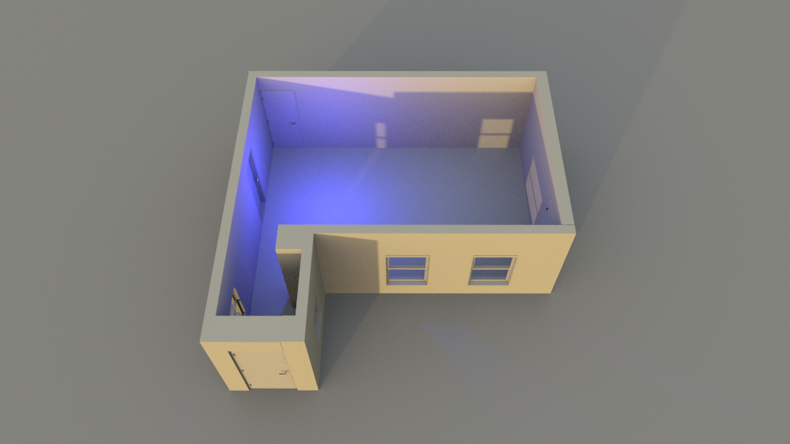

# ESPectre WiFi Sensing System

> Built on top of the original [ESPectre](https://github.com/EdoardoLuciani/espectre) project by Edoardo Luciani.

A room-level Wi-Fi motion sensing and spatial classification system using Wi-Fi Channel State Information (CSI) collected from a single ESP32-S3 node and processed through a distributed pipeline. The final validated prototype operates in a single-room deployment using commodity hardware, without requiring router firmware modification.

---

## Project Status

- Final validated prototype: single-room deployment.
- Implemented sensing node: Room B.
- Spatial classes: no motion, zone 1, and zone 2.
- Inference pipeline: ESP32-S3 feature extraction + MQTT + AppDaemon Random Forest inference.
- Future work: second ESP32 node for full two-room deployment.

---

## How It Works

The system exploits the fact that human movement disturbs the multipath propagation of WiFi signals in a measurable and spatially-dependent way. By analysing the per-subcarrier amplitude patterns of CSI frames collected at the ESP32 receiver, a trained Random Forest classifier can distinguish between:

- **Baseline** — no movement / empty room
- **Quadrant 1** — movement in the hallway area
- **Quadrant 2** — movement in the stairway area

Classification runs continuously in Home Assistant at approximately 20--30 predictions per second, with results exposed as a sensor entity that can trigger automations.

---

## System Architecture
> Final validated prototype: single-room deployment (Room B), with architecture designed for future two-room expansion.
```
┌─────────────────────┐         MQTT          ┌──────────────────────────────┐
│      ESP32-S3       │  ──────────────────►  │   Raspberry Pi / Home        │
│                     │                       │   Assistant Pipeline          │
│ - Collects CSI      │   JSON payload        │                              │
│ - CSI feature       │   ~20–30 Hz           │ - AppDaemon classifier       │
│   extraction        │                       │ - Random Forest inference    │
│ - Fixed BSSID       │                       │ - Sensor entity output       │
│ - Autonomous boot   │                       │ - Lovelace dashboard         │
└─────────────────────┘                       └──────────────────────────────┘
                                                           ▲
                                                           │  .pkl model deploy
                                                           │
                                              ┌──────────────────────────────┐
                                              │      Training (Laptop)       │
                                              │                              │
                                              │ - CSV data collection        │
                                              │ - Windowed feature pipeline  │
                                              │ - Session-aware split        │
                                              │ - Model training/export      │
                                              └──────────────────────────────┘
```

### ESP32 Node
The ESP32-S3 operates in STA mode and is pinned to a fixed mesh BSSID to prevent mid-session roaming between nodes, which was identified as an important stability issue during implementation. It continuously stimulates CSI feedback, extracts CSI features using a modified *Micro-ESPectre* build, and publishes aggregated feature vectors to an MQTT topic as serialised JSON payloads. In the final architecture, the ESP32 performs CSI extraction and feature pre-processing rather than full classification inference.

```

09:48:54: home/espectre/node1
{
    "confidence": 0.218,
    "features": {
        "amp_mean": 11.404,
        "amp_mean_high": 10.917,
        "amp_mean_low": 18.302,
        "amp_mean_mid": 5.015,
        "amp_range": 91.0,
        "amp_std": 11.216,
        "entropy_turb": 2.113,
        "iqr_turb": 0.402,
        "kurtosis": 36.775,
        "phase_diff_mean": 0.052,
        "phase_diff_range": 9.3588,
        "phase_diff_skew": -3.4234,
        "phase_diff_std": 1.3,
        "phase_mean": -0.1107,
        "phase_range": 6.1835,
        "phase_std": 1.8598,
        "sc_amps": [
            18.44, 18.36, 17.03, 15.26, 14.32, 14.04, 13.0, 12.81, 13.04,
            11.4, 12.04, 10.77, 10.63, 10.3, 10.2, 10.05, 8.54, 8.6, 7.21,
            6.32, 6.08, 7.81, 8.06, 7.28, 8.0, 8.54, 8.94, 8.49, 8.94,
            9.22, 9.06, 9.22, 9.85, 7.81, 9.22, 8.94, 9.22, 10.05, 9.49,
            10.3, 10.63, 11.66, 11.4, 11.0
        ],
        "skewness": 5.489,
        "variance_turb": 0.287
    },
    "friendly_name": "ESP32 CSI Raw",
    "movement": 0.287,
    "packets_dropped": 5,
    "packets_processed": 1,
    "pps": 17,
    "threshold": 0.5053,
    "timestamp": 1797,
    "triggered": [
        "skewness"
    ]
}
```
### Home Assistant Classifier
An *AppDaemon* app subscribes to the MQTT topic and feeds incoming feature vectors into the deployed Random Forest model running on the Raspberry Pi / Home Assistant stack. Each prediction is published back as a Home Assistant sensor entity such as `sensor.csi_location`, which is then visualised through a Lovelace dashboard. The final thesis implementation uses this distributed architecture because full classification on the ESP32 was re-scoped during implementation.

| Baseline | Quadrant 1 (Hallway) | Quadrant 2 (Stairs) |
|:---:|:---:|:---:|
|  |  |  |
| No movement detected | Movement in hallway | Movement on stairs |

### Training Pipeline
CSI data is recorded to CSV files on a laptop and organised by class and door-state condition. A windowed feature extraction pipeline builds per-window feature vectors from aggregate CSI statistics and valid subcarrier amplitudes, and the dataset is split at the session level rather than the window level to avoid data leakage. The trained model is exported as `.pkl` files and manually deployed to the Home Assistant / AppDaemon environment for live inference.

---

## Project Structure
```
/
├── espectre-home/ 
│ └── ... # Orginal Espectre deployment - motion detection
│
├── Home Assistant Scripts/ 
│ └── ... # HA configuration scripts
│
├── micro-espectre/ 
│ └── ... # MicroPython firmware for ESP32-S3/C6
│
├── Testing/ 
│ └── ... # Scripts to evaluate real world performance
├── Training/ 
│ └── ... # RF training script, model evaluation, feature analysis
│
└── Record Data/ 
└── ... # Data collection scripts and CSV output management
```

---

## Training Data Convention

CSV files are named using the following convention to encode the environmental condition at collection time:
```
csi_training_data_<class><d1><d2><d3><YYYYMMDD>_<HHMMSS>.csv
```

Where `<d1>_<d2>_<d3>` is a binary door state vector:
```
| State     | Meaning                          |
|-----------|----------------------------------|
| `0_0_0`   | All doors closed                 |
| `1_0_0`   | Living room door open            |
| `0_1_0`   | Study room door open             |
| `0_0_1`   | Kitchen door open                |
| `0_1_1`   | Study room + kitchen open        |
| `1_1_1`   | All doors open                   |
```
Each door state requires a minimum of **3 sessions per class** to provide sufficient variance for the Random Forest to learn generalising splits. Data should always be collected with the ESP32 **pinned to a fixed BSSID** to prevent multipath environment shifts caused by mesh node roaming.

---

## Model Performance

In the final thesis evaluation, the system achieved over 90% spatial classification accuracy in the validated single-room deployment. Physical testing reported active-zone accuracies of 92.3% for zone 1 and 90.9% for zone 2, while average network traffic remained 18.49 KB/s with a measured peak of 21.50 KB/s, staying within the stated 25 KB/s constraint. Mean inference latency was 17.50 ms, with p95 latency of 24.00 ms and a maximum observed latency of 145.34 ms.

---

## Dependencies

### ESP32 (MicroPython)
- Custom MicroPython build with CSI support (`wlan.csi_enable()`)
- `umqtt.simple`

### Home Assistant
- AppDaemon 4.x
- `scikit-learn`
- `numpy`
- `joblib`

### Training (Python 3.10+)
- `scikit-learn`
- `numpy`
- `pandas`
- `joblib`

---

## Setup

> Assumes Home Assistant, MQTT broker (Mosquitto), and AppDaemon are already configured. Refer to the thesis for full deployment context.

1. Flash MicroPython with CSI support to the ESP32
2. Configure `src/config.py` with WiFi credentials and target BSSID
3. Deploy `micro-espectre/` to the ESP32
4. Copy the AppDaemon app from `espectre-home/` to your HA `apps/` directory
5. Collect training data using the scripts in `Record Data/`
6. Train the model using `Training/test4.py` — outputs `rf_spatial_classifier.pkl` and `rf_scaler.pkl`
7. Deploy the `.pkl` files to the AppDaemon app directory
8. Restart AppDaemon — the `sensor.csi_location` entity will appear in HA

---
## Notes

- The validated thesis prototype is a single-room deployment rather than the originally planned full two-room implementation.
- The architecture and code remain compatible with a second ESP32 node for future expansion.
- The implementation was validated on a commodity Starlink Gen 2 mesh network without router firmware modification.

---
## Credits

This project extends the original [ESPectre](https://github.com/EdoardoLuciani/espetre) WiFi CSI sensing framework by Edoardo Luciani, adapting it for room-level localisation on ESP32-S3/C6 hardware with a custom Home Assistant integration and Random Forest classifier pipeline.

